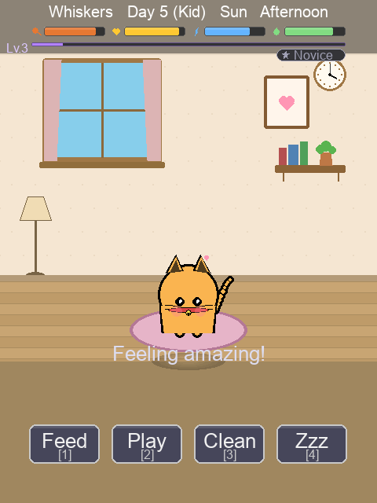
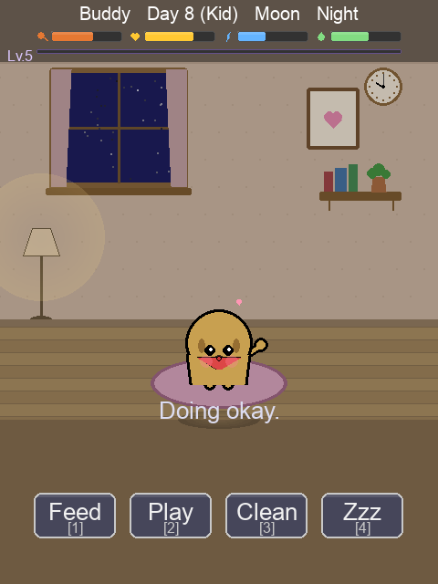
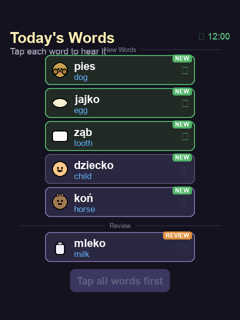
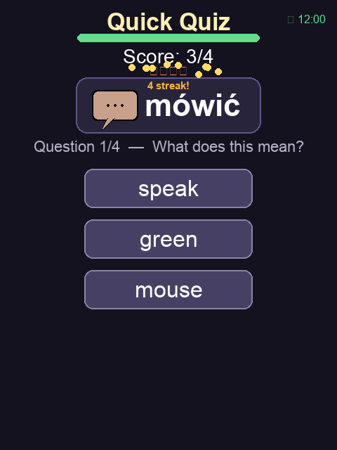
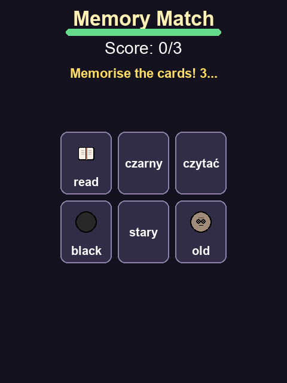
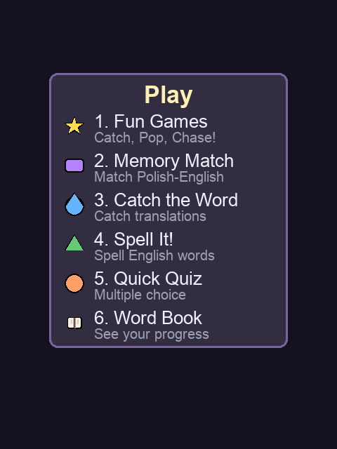
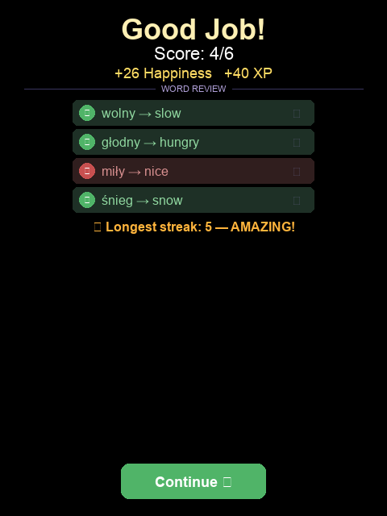
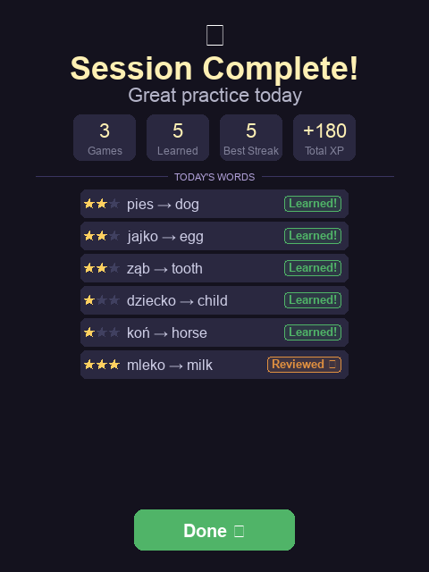
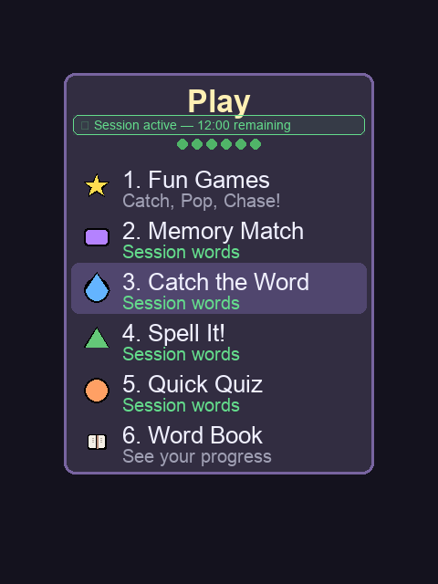

# Tamagotchi Learning Languages

A kid-friendly virtual pet game with Polish-English vocabulary learning, built with Python + pygame. All graphics are procedural (no sprite assets). Target audience: young children learning Polish.

## Features

### Virtual Pet Care
- Feed, play, clean, and put your pet to sleep
- Day/night cycle with dynamic room lighting
- Pet grows through 3 stages: Baby, Kid, Adult
- Evolution tiers based on care quality (thriving/normal/scruffy)
- Sickness system with medicine mini-game

| Daytime | Nighttime |
|---------|-----------|
|  |  |

### Learning Sessions
Structured 12-minute learning sessions with a curated word set:
- **4-6 new words** introduced each session
- **2-4 review words** (rusty/struggling words that need reinforcement)
- All edu games during a session draw from the same word set for cross-game reinforcement

### Today's Words
Before your first game, meet your session words! Tap each card to hear the pronunciation.



### Educational Games
4 different game types, each testing vocabulary in a different way:

| Quick Quiz | Memory Match |
|------------|--------------|
|  |  |

- **Quick Quiz** - Multiple choice: see Polish word, pick English translation
- **Memory Match** - Flip cards to match Polish-English pairs
- **Catch the Word** - Click the correct English translation as words fall
- **Spell It!** - Spell the English word letter by letter from scrambled tiles



### Streak Rewards
Get answers right in a row and watch the streak counter grow! Gold sparkle effects at 3 and 5 streaks.

### Interactive Results
After each game, review every word you practiced. Tap the speaker icon to hear any word again.



### Session Complete
When your session timer runs out, see a full summary of your progress.



### Active Session Tracking
The Play menu shows your session status with word progress dots and remaining time.



## Vocabulary System

- **90+ Polish-English words** across 3 tiers
- **Spaced repetition** using Leitner boxes (struggling words appear more often)
- **Rusty word detection** - mastered words not seen in 3+ days get prioritized for review
- **Tier unlocking** - learn 10 words to unlock the next tier

| Tier | Content | Unlock |
|------|---------|--------|
| Tier 1 | Animals, food, body parts, feelings, family | Always available |
| Tier 2 | Colors, numbers, adjectives, weather | 10 Tier-1 words learned |
| Tier 3 | Verbs, polite phrases, nature | 10 Tier-2 words learned |

## Running

```bash
# Install dependencies
pip install pygame

# Optional: install gTTS for word pronunciation
pip install gtts

# Run the game
python3 main.py
```

The game window opens at 720x960 (480x640 design resolution at 1.5x scale).

### Controls
- **1-4**: Feed, Play, Clean, Sleep
- **ESC**: Back / Save & quit
- In Play menu: **1-6** to select game or Word Book

## Tech Stack
- Python 3 + pygame
- Procedural drawing only (no sprite assets)
- Procedural audio synthesis (no sound files)
- Optional gTTS for word pronunciation
- JSON save/load with backward compatibility
